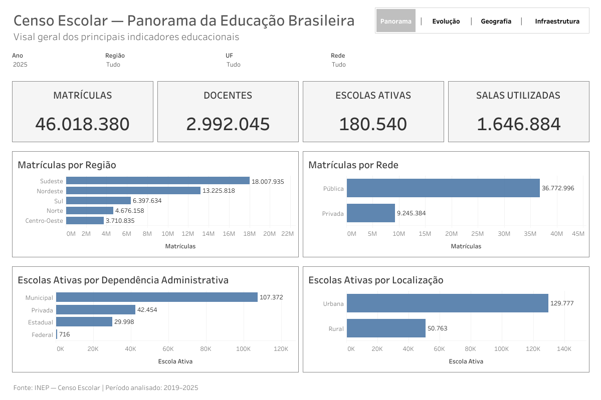
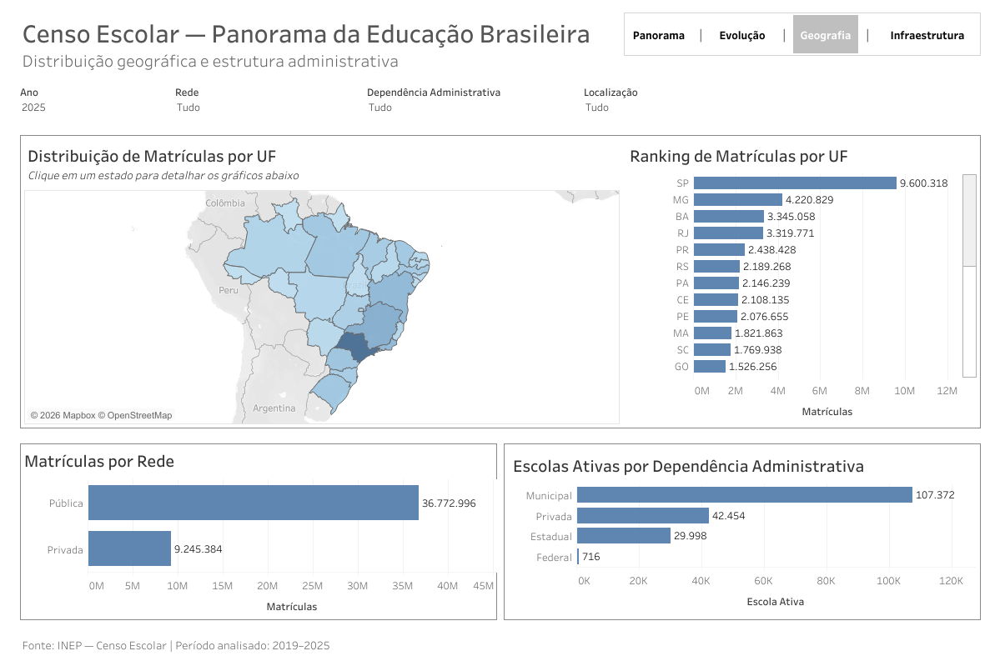
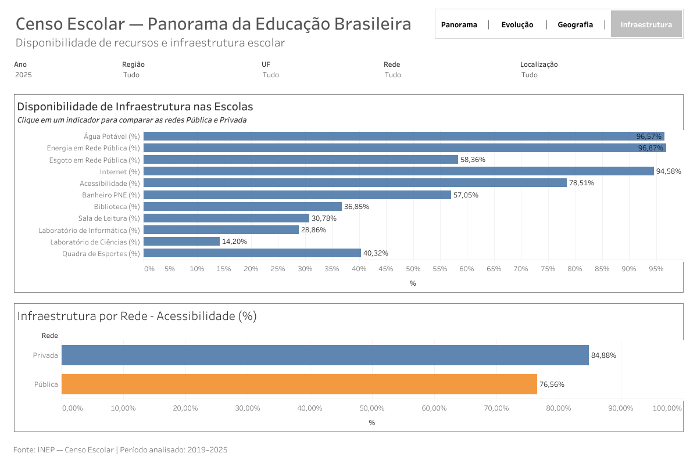
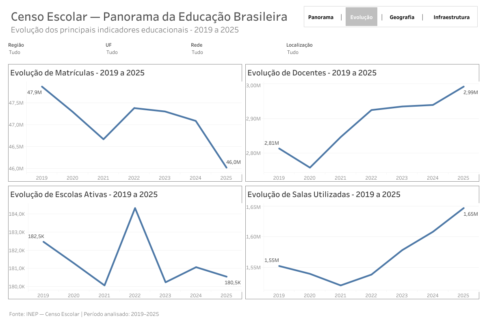

# Censo Escolar BI/Analytics

Projeto de **BI/Analytics** desenvolvido a partir de dados públicos do **Censo Escolar**, disponibilizados pelo Instituto Nacional de Estudos e Pesquisas Educacionais Anísio Teixeira (INEP).

O projeto transforma dados educacionais públicos em informações analíticas por meio de processos de exploração, qualidade, tratamento, modelagem e visualização de dados, utilizando **Python** e **Tableau** ao longo do ciclo analítico.

## 🎯 Objetivo

Desenvolver uma solução analítica para explorar informações da Educação Básica brasileira, permitindo análises sobre:

* evolução histórica dos principais indicadores;
* distribuição geográfica;
* estrutura administrativa das escolas;
* matrículas;
* docentes;
* escolas ativas;
* salas utilizadas;
* infraestrutura escolar.

## 📊 Fonte dos dados

Os dados utilizados neste projeto são provenientes dos **Microdados do Censo Escolar da Educação Básica**, disponibilizados oficialmente pelo Instituto Nacional de Estudos e Pesquisas Educacionais Anísio Teixeira (INEP).

**Período analisado:** 2019 a 2025

**Fonte oficial:**
https://www.gov.br/inep/pt-br/acesso-a-informacao/dados-abertos/microdados/censo-escolar

Os arquivos originais foram obtidos diretamente da fonte oficial e preservados sem alterações na etapa de aquisição dos dados.

Durante o desenvolvimento do projeto, os microdados passaram por processos de exploração, validação, tratamento, padronização e consolidação para geração da base analítica utilizada no Tableau.

A rastreabilidade da origem, versão, período e processo de transformação dos dados é mantida na documentação do projeto.

Para informações detalhadas sobre a fonte dos dados, consulte:

[`documentation/fonte_dados.md`](documentation/fonte_dados.md)

## 🛠️ Tecnologias

* **Python** — exploração, validação, tratamento, transformação e consolidação dos dados
* **Pandas** — manipulação e análise das bases do Censo Escolar
* **Tableau** — desenvolvimento dos dashboards e visualizações analíticas
* **Tableau Public** — publicação e disponibilização interativa dos dashboards
* **Git / GitHub** — versionamento, documentação e gerenciamento do projeto
* **GitHub Projects** — acompanhamento das atividades por meio de Issues, Milestones e Kanban
* **CSV** — formato utilizado para armazenamento e integração das bases analíticas

## 📁 Estrutura do projeto

```text
censo-escolar-bi/
│
├── data/
│   ├── raw/              # Dados originais
│   └── processed/        # Dados tratados
│
├── documentation/        # Documentação e referências
│
├── scripts/              # Scripts de tratamento e transformação
│
├── tableau/              # Arquivos relacionados ao Tableau
│
└── README.md             # Documentação principal do projeto
```

## 🚧 Status do projeto

**Em evolução**

### Fases do projeto

* [x] **M1 — Definição do projeto**
* [x] **M2 — Fonte e aquisição dos dados**
* [x] **M3 — Exploração e qualidade dos dados**
* [x] **M4 — Tratamento e transformação**
* [x] **M5 — Modelagem dos dados**
* [x] **M6 — Construção dos Dashboards**
* [x] **M7 — Publicação e Documentação**
* 🔄 **M8 — Manutenção e Atualização** - etapa contínua

Atualmente, o projeto encontra-se na **M7 — Publicação e Documentação**, com os dashboards já construídos, validados e publicados no Tableau Public.

## 📌 Escopo analítico

O projeto analisa informações do **Censo Escolar da Educação Básica no período de 2019 a 2025**.

A base consolidada utilizada para análise possui granularidade de:

`Escola × Ano`

permitindo acompanhar a evolução histórica das unidades escolares ao longo do período analisado.

Entre as principais dimensões utilizadas estão:

* Região;
* Unidade da Federação (UF);
* Município;
* Rede de ensino;
* Dependência administrativa;
* Localização;
* Situação de funcionamento.

Entre os principais indicadores analisados estão:

* Matrículas;
* Docentes;
* Escolas ativas;
* Salas utilizadas;
* Indicadores de infraestrutura escolar.

O projeto permite análises nacionais e diferentes recortes geográficos e administrativos, mantendo comparabilidade histórica entre os anos disponíveis.

## 📈 Dashboards

A solução foi organizada em quatro dashboards analíticos:

### D01 — Panorama Geral

Apresenta uma visão consolidada dos principais indicadores do Censo Escolar, incluindo matrículas, docentes, escolas ativas e salas utilizadas.



### D02 — Geografia e Administração

Explora a distribuição territorial dos dados educacionais e permite análises por Unidade da Federação, Rede e Dependência Administrativa.



### D03 — Infraestrutura Escolar

Analisa a disponibilidade de recursos e infraestrutura nas escolas, permitindo também comparar os indicadores entre as redes Pública e Privada.



### D04 — Evolução Histórica

Apresenta a evolução dos principais indicadores educacionais entre **2019 e 2025**, permitindo acompanhar tendências ao longo do período analisado.



## 🌐 Tableau Public

A versão interativa do projeto está publicada no Tableau Public:

**[Acessar Censo Escolar — Panorama da Educação Brasileira](https://public.tableau.com/app/profile/sidneisouzajr/viz/CensoEscolar-BIAnalytics/D01-PanoramaGeral)**

A visualização permite navegar entre os dashboards:

`Panorama | Evolução | Geografia | Infraestrutura`

e utilizar filtros para explorar diferentes recortes dos dados.

## 📚 Documentação

O desenvolvimento do projeto é documentado por meio de arquivos técnicos, Issues, Milestones e histórico de commits no GitHub.

A documentação contempla diferentes etapas do ciclo de dados, incluindo:

* definição e escopo do projeto;
* fonte e aquisição dos dados;
* exploração e qualidade;
* tratamento e transformação;
* modelagem para BI;
* construção dos dashboards;
* validações;
* filtros, ações e navegação;
* publicação no Tableau Public.

Entre os principais documentos estão:

* [`documentation/fonte_dados.md`](documentation/fonte_dados.md) — origem e rastreabilidade dos dados;
* [`tableau/tableau.md`](tableau/tableau.md) — desenvolvimento, decisões e validações relacionadas aos dashboards.

O acompanhamento das atividades é realizado por meio do **GitHub Projects**, utilizando Issues e Milestones para registrar a evolução do projeto.

---

**Projeto desenvolvido para fins de estudo, portfólio profissional e demonstração de práticas de Business Intelligence e análise de dados.**
